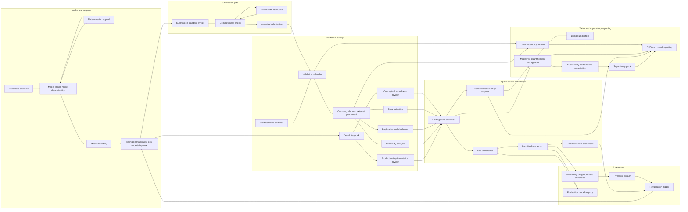

# Assayline

**Source:** `ai-in-cyber/The-evolution-of-model-risk-management/`
**Domain:** `ai-cyber`
**One-liner:** A validation factory operating system for bank model risk functions: it refuses a validation slot to an incomplete submission, sizes validation depth to the model's tier, and turns the conservatism buried inside approved models into a priced, owned register that releases capital.
**Wedge:** Model risk management functions at European banks between one hundred billion and five hundred billion euros of assets that are still building foundational MRM — a policy, an inventory, a manual workflow — while their model estate grows at double digits a year and their validation headcount does not. The entry point is narrower still: the submission gate, because the source identifies incomplete submissions as the single largest cause of validation delay, and fixing it requires no new validators.
**Positioning:** An industrialised validation line, not a model inventory tool. GRC platforms hold a register of models and a workflow for approvals; consultancies sell validation capacity by the model. Neither manages the thing that actually constrains a model risk function, which is throughput per validator against a queue that grows faster than the team. Assayline treats validation as a production system with a gate, a calendar, tiered playbooks, and a unit cost — and then makes the case the source makes for value rather than compliance, by pulling the implicit conservatism scattered through approved models into an explicit, governed register that senior management can decide how much of to keep.

## Market research synthesis

### Thesis from source

The paper's premise is a volume problem with a talent ceiling. Model counts at large institutions are rising 10 to 25 percent annually as banks push models into an ever wider scope of decision making, and the benchmarking behind the article found estates ranging from 100 to 3,000 models per bank. The models are not only the regulatory ones — capital provisioning and stress testing — but increasingly business models for pricing, strategic planning, and asset-liquidity management, plus advanced-analytics applications in customer relationship management, anti-money laundering, and fraud detection. Meanwhile staffing is thin and unevenly distributed: European banks dedicate an average of 8 full-time equivalents to MRM and validation per €100 billion of assets, against 19 for US banks, and nearly three-quarters of banks reported being understaffed in MRM. Most still lean heavily on external consultants for validation.

The consequences of getting it wrong are documented in specifics, and they split evenly between defective models and misused ones — a distinction the article insists on. A coding error that distorted the flow of information from a risk model into a portfolio-optimisation process cost one institution several hundred million dollars. A global bank applied a risk-hedging tool aggressively enough to breach its value-at-risk limits for nearly a week and, because the model was inadequately governed and validated, responded by adjusting control parameters rather than changing its investment strategy — a loss running into the billions. Another was fined hundreds of millions for misusing a counterparty-risk capital calculation model. Misuse, not defect, produced the largest of the three.

Supervisory response is the frame the product has to fit. SR 11-7, published by the US Federal Reserve Board in April 2011, gave the industry its standard definition: model risk is the potential for adverse consequences from decisions based on incorrect or misused model outputs and reports. It addresses errors at any point from design through implementation, and it requires decision makers to understand a model's limitations and avoid using it inconsistently with its original intent. The European Banking Authority's supervisory review process requires model risk to be identified, mapped, tested, and reviewed, treats it as a material risk to capital, and asks institutions to quantify it — with the fallback that if capital needs for a specific risk cannot be calculated, a comprehensible lump-sum buffer must be fixed instead. The two regimes diverge in practice: US supervisors are strict about the three lines of defence and expect proper control of all material models whatever their type, with material models validated in great detail including systematic replication and challenger models; in Europe conceptual validations are still accepted in many cases, model implementation in production systems is not validated consistently, the regulatory focus falls mainly on regulatory models, and few banks have a control and governance unit responsible for MRM policy and appetite, where nearly all US banks have an MRM unit.

The operational diagnosis is the commercially useful part. Asked what most damages validation timelines, 76 percent of respondents named incomplete or poor quality of model submissions — far ahead of insufficient resources at 14 percent and the need to validate every model comprehensively at 10 percent. Submissions missing key components such as data, feeder models, or monitoring plans reduce efficiency and extend delivery time. Validation duration reflects the chaos: a few days to 30 weeks in Europe, one to 17 weeks in the United States, with pass and fail rates varying widely by model. The fix the article describes is industrialisation. An end-to-end approach can cut model-related costs by 20 to 30 percent, decomposed as prioritisation worth 30 percent of savings, a portfolio-management office with supporting tools worth 25 percent, and automation of well-defined repetitive validation tasks such as standardised testing and model replication worth another 25 percent. Consistent standards for model planning and development conserve up to 15 percent of MRM resources; streamlining the validation organisation saves up to 25 percent in cost. The concrete mechanism is tiering — classifying models on quantitative and qualitative criteria including materiality, risk exposure, and regulatory impact, then placing validation on a continuum with high-risk models getting full validation and low-risk models light validation — run by a project-management office that owns a validation calendar, playbook, resource allocation, submission standards, documentation templates, testing routines, a workflow system, and industry benchmarks, feeding an onshore validation factory across three tiers with an offshore group taking data validation, replication, standard testing, sensitivity analysis, initial documentation, and monitoring review.

Two further findings define where the product earns money rather than saves it. First, governance is patchy in a measurable way: about half the surveyed banks integrated model risk into their risk-appetite statement, but only around 20 percent use specific key performance indicators for model risk, mostly model performance and open validation findings; all have a model governance framework yet 60 percent apply it only to main models such as internal-ratings-based and stress-testing models; half have a model risk policy; for 60 percent model ownership sits with users, which the article calls the preferred arrangement because it engages the business on data and modelling assumptions; and risk committees authorise model-use exceptions in around 70 percent of cases. Most MRM groups report to the chief risk officer or a direct report, and boards discuss MRM in at least six meetings a year. Second, and most interesting, the article identifies capital inefficiency created by the MRM function's own failure to make conservatism explicit. Modellers facing uncertainty make conservative assumptions at various points; those assumptions and their attendant conservatism are often implicit, poorly documented, and unjustified, and the resulting opacity leads to haphazard application of conservatism across several components of a model, which is costly. Proper validation increases transparency on model uncertainties and assumptions, which lets senior management judge where and how much conservatism is needed — typically presented as explicit overlays at precise, well-defined locations, subject to management oversight. Total conservatism usually falls as a result. Add to that the supervisory add-ons requested when MRM is judged inadequate, and the capital story is concrete: at one global bank the capital budget for models rose sevenfold in four years, from €7 million to €51 million.

Finally, a definitional problem sits under everything and the article names it plainly: the industry still has no standard for what should be defined as a model, banks differ on this basic question, and the result is large disparities in model-inventory statistics. An inventory whose boundary is undocumented cannot support a capital quantification, a tiering decision, or a supervisory conversation. The article's maturity model has three stages — foundational elements, implementation and execution, and capturing value — and observes that most North American banks sit in stage 2 while many European peers remain in stage 1.

### Buyer & economic model

- **Primary buyer:** the Head of Model Risk Management, reporting to the chief risk officer or a direct report. The economic buyer is the CRO, and where the pitch is framed as capital release rather than cost reduction it is co-sponsored by the CFO or the head of capital management.
- **Users:** the validation project-management office lead who owns the calendar and the standards; onshore validators performing conceptual soundness review, replication, and challenger construction; an offshore validation group taking data-quality testing, standardised testing, sensitivity analysis, and initial documentation; model developers and the centre-of-excellence teams that submit; model owners in the business, who under the source's preferred arrangement carry responsibility for decisions made on their models; the independent control and governance unit that maintains policy and appetite; internal audit as third line; the risk committee secretary who processes model-use exceptions; and the supervisory relations lead who assembles the regulator pack.
- **Budget owner / value metric:** the model risk function's own cost base, plus the external validation spend the source says most banks still rely on. Three value metrics in ascending order of interest to the CRO: cost per validated model and validation cycle time by tier; supervisory capital add-ons and lump-sum buffers avoided; and total explicit conservatism reduced once it has been located and priced.
- **Competing status quo:** a spreadsheet inventory whose model-versus-nonmodel boundary lives in one person's head, a shared mailbox for submissions, a Word validation template, a consultancy engaged per model at day rates, and an annual attestation to the board. There is no capacity model, so validation duration is whatever it turns out to be — the source's few days to 30 weeks — and no attribution of delay, so a submission returned three times looks like slow validation.

### Domain constraints

- **Regulatory / trust / safety:** independence is structural, not procedural. Validation must be independent of development, and the control and governance unit independent of validation, with internal audit independent of all of them — a three-lines arrangement US supervisors examine directly. Model risk must be identified, mapped, tested, reviewed, and quantified as a material risk to capital, with a lump-sum buffer where quantification is impossible, which means the inventory and its tiering are capital-relevant records. Material models require detailed validation including systematic replication and challenger models, and implementation in production systems is itself in scope. Decision makers must be evidenced to understand a model's limitations and must not use it inconsistently with its original intent, which makes the permitted-use record as regulated as the validation report. Outsourced validation does not transfer accountability, and jurisdictional divergence is permanent: the same estate may need US-standard treatment for material models and EU-standard treatment for regulatory models simultaneously.
- **Data sensitivity:** validation requires the model's development data, which in banking means customer, credit, transaction, and trading records, and replication requires enough of it to rebuild the model. An offshore validation group therefore creates a cross-border transfer question on the bank's most sensitive data, and the practical answer is that offshore work must run on masked, sampled, or synthetic data with the boundary recorded per task. Challenger models and sensitivity analyses reveal exploitable structure in pricing and credit decisioning, so their circulation is restricted. Conservatism overlays are commercially sensitive in both directions — they reveal where the bank believes its own models are weak, and their removal changes reported capital.
- **Change-management realities:** the gate is the political fight. Refusing a validation slot to an incomplete submission moves visible delay from the validation team onto the business, and it will be escalated the first time it blocks a product launch, so the standard and the returns must be owned by the control unit with a committee-approved appeal path rather than defended case by case by validators. Tiering is the second fight, because a light validation on a business-critical model reads as a downgrade to its owner. And the conservatism register asks modellers to expose judgement calls they have historically left implicit, which will be resisted unless the framing is that explicit conservatism survives review and implicit conservatism gets removed.

## Business requirements

- BR-1: Every artefact in scope must carry a written, dated determination of whether it is a model or not a model, with the criteria applied, the determiner named, and an appeal path — because an inventory whose boundary is undocumented cannot support a capital quantification or withstand supervisory challenge, and the source identifies exactly this absent standard as the cause of incomparable inventories.
- BR-2: No model may occupy a validation slot until its submission satisfies the published completeness standard, including data, feeder models, monitoring plan, documentation, and disposition of prior findings; returned submissions must be attributed to the submitting function so that delay caused upstream is not recorded as validation slowness.
- BR-3: Validation depth must be a function of the model's tier, and tier must be set from materiality, potential financial loss, parameter uncertainty, regulatory impact, and intended use — with full validation including replication and a challenger model mandatory for the highest tier and light validation permitted for the lowest.
- BR-4: The function must publish and hold a capacity commitment — validation cycle time by tier and cost per validated model — and must forecast the effect of the estate's growth rate on that commitment, so that a queue growing faster than the team becomes a governance decision rather than an emergent backlog.
- BR-5: Conservatism applied inside a model must be recorded as an explicit overlay with its location in the model, its magnitude, its rationale, an accountable approver, and a review date; a model may not be approved with material undocumented conservatism, and the aggregate conservatism carried by the estate must be reported to senior management as a decision they own.
- BR-6: Each model must carry a permitted-use record stating what decisions it may inform, and any use outside that record must be an authorised exception with a committee decision, an expiry, and a compensating condition — because the source's largest documented loss came from misuse of a sound tool rather than from a defective model.
- BR-7: Independence must be enforced rather than asserted: the platform must prevent a person from validating a model they developed, and from performing the control-unit review of a validation they conducted, and must record every instance where the separation was overridden and by whom.
- BR-8: Model risk must be quantified per model and in aggregate against the institution's stated model risk appetite, with a documented lump-sum buffer where quantification is not possible, and with a named set of key performance indicators covering at minimum model performance and open validation findings.
- BR-9: Findings must constrain use: an open finding above a defined severity on a given tier must automatically restrict the model's permitted use or require a compensating overlay until closed, rather than sitting in a tracker while the model runs unchanged.
- BR-10: Ongoing monitoring and back-testing obligations must be assigned to the model owner and the developing team at approval, with defined thresholds and a revalidation trigger, so that revalidation is caused by measured deterioration or by a change in use rather than by an annual calendar alone.
- BR-11: Supervisory capital add-ons and lump-sum buffers attributed to MRM inadequacy must be tracked as a managed liability with a remediation plan and a measured reduction, and the function must be able to assemble a supervisory pack from the live record rather than reconstructing one per examination.
- BR-12: Work placed with an offshore group or an external provider must remain accountable to the institution, must record the data-sensitivity basis on which it was placed, and must be reported with its share of total validation effort and its unit cost, so that outsourcing is a managed capacity decision with a visible price rather than an overflow habit.

## User stories

Canonical user stories live in sibling [USER_STORIES.md](USER_STORIES.md).

## System design

### Overview

Assayline runs a bank's model estate as a production line with four gates and one register that makes it pay for itself.

The first gate is definitional: every candidate artefact receives a recorded model-or-not determination against published criteria, which fixes the inventory boundary and makes the inventory count defensible. The second is tiering: each model in scope is tiered on materiality, potential loss, parameter uncertainty, regulatory impact, and intended use, and the tier selects a validation playbook — full validation with replication and a challenger model at the top, light validation at the bottom. The third gate is submission completeness: a validation slot is not allocated until the submission satisfies the standard, and every return is attributed to the submitting function with its missing components named. The fourth is approval: a model leaves validation with a permitted-use record, monitoring obligations and thresholds, conservatism overlays, and findings that may constrain its use until closed.

Between the gates sits the factory. A validation calendar allocates slots against a validator capacity model that knows skills and load, and routes decomposable work — data-quality testing, standardised testing, replication, sensitivity analysis, initial documentation, monitoring review — onshore or offshore according to a recorded data-sensitivity basis. Unit economics accumulate as the work runs: effort per task, cycle time by tier, cost per validated model, and the share of effort placed externally.

The register that changes the commercial argument is the conservatism ledger. Each conservative assumption inside an approved model is recorded at its location with a magnitude, rationale, approver, and review date, so the aggregate conservatism the estate carries becomes a number senior management owns and can reduce deliberately. Alongside it, a supervisory liability tracker holds capital add-ons and lump-sum buffers attributed to MRM inadequacy with their remediation plans, and the two together are what turn the function's reporting from cost to capital.

Ongoing monitoring closes the loop: owners and developers carry threshold-based monitoring obligations, breaches and changes of use trigger revalidation, and revalidated models re-enter the line at their tier.

### Actors & boundaries

- **Actors:** head of model risk management, validation PMO lead, onshore validators, offshore validation group, model developers and centre-of-excellence teams, model owners in the business, the independent control and governance unit, internal audit, risk committee and its secretary, supervisory relations lead, capital management. External validation providers are capacity with accountability retained by the institution.
- **Trust boundary:** three separations are enforced by the system rather than by policy text. Development is separated from validation, so a developer cannot validate their own model. Validation is separated from control, so the person who validated cannot perform the control-unit review or alter the standard they were measured against. And the standard-setting boundary keeps completeness criteria, tiering criteria, and appeal outcomes with the control unit and the risk committee, outside the reach of both the submitting business and the validation team. A fourth, data boundary governs offshore and external placement: tasks may cross it only with a recorded sensitivity basis and on masked, sampled, or synthetic data, and replication tasks requiring full development data are confined inside it.
- **Human-in-the-loop points:** the model-or-not determination and its appeal; tier assignment and tier challenge; submission return decisions; conceptual soundness judgement, which is irreducibly expert work; finding severity assignment; conservatism overlay approval; permitted-use definition; model-use exception authorisation by the risk committee; and internal audit's independent testing of whether depth matched tier.

### Core capabilities

1. **Inventory boundary determination** — recorded model-or-not decisions against published criteria, with determiner, date, rationale, and appeal path.
2. **Model inventory and tiering** — the estate with materiality, potential loss, parameter uncertainty, regulatory impact, intended use, tier, and tier history.
3. **Submission standards and gate** — published completeness requirements by tier, gap detection, slot refusal, and return attribution by submitting function and missing component.
4. **Validation calendar and capacity model** — slot allocation against validator skills and load, cycle-time commitments by tier, and forward capacity forecasting against estate growth.
5. **Tiered validation playbooks** — scope definition per tier across conceptual soundness review, data validation, replication, challenger construction, sensitivity analysis, documentation, and production implementation review.
6. **Work placement and sourcing control** — onshore, offshore, and external routing with a recorded data-sensitivity basis and per-placement unit cost.
7. **Findings and use constraints** — severity-graded findings that automatically restrict permitted use or require compensating overlays until closed.
8. **Conservatism overlay register** — explicit conservatism at named model locations with magnitude, rationale, approver, review date, and estate-level aggregation.
9. **Permitted use and exception management** — the use record per model, plus committee-authorised exceptions with expiry and conditions.
10. **Ongoing monitoring and revalidation triggers** — owner and developer monitoring obligations, thresholds, breach detection, and change-of-use triggers.
11. **Model risk quantification and appetite** — per-model and aggregate quantification against stated appetite, with documented lump-sum buffers where quantification is impossible, and the KPI set.
12. **Supervisory liability tracking and pack assembly** — capital add-ons and buffers with remediation plans, and examination packs generated from the live record.
13. **Independence enforcement and unit economics** — system-enforced role separation with override logging, plus cost per validated model, effort by task type, and external effort share.

### Conceptual data

- **Primary entities:** Artefact, ModelDetermination, Model, ModelVersion, TierAssessment, TierCriteria, SubmissionStandard, Submission, SubmissionReturn, ValidationSlot, ValidationEngagement, ValidationTask, Validator, ValidatorSkill, WorkPlacement, Playbook, PlaybookStep, ConceptualSoundnessReview, ReplicationResult, ChallengerModel, SensitivityAnalysis, ImplementationReview, Finding, FindingClosure, UseConstraint, ConservatismOverlay, PermittedUse, UseException, MonitoringObligation, MonitoringBreach, RevalidationTrigger, ModelRiskQuantification, RiskAppetiteStatement, LumpSumBuffer, SupervisoryAddOn, RemediationPlan, SupervisoryPack, UnitCostRecord, IndependenceOverride, ApprovalRecord.
- **Critical events:** artefact determined in or out of scope; determination appealed and overturned; model tiered or re-tiered; submission received, gapped, returned, or accepted; slot allocated, deferred, or released; task placed onshore, offshore, or externally; conceptual soundness concluded; replication reproduced or failed to reproduce; challenger constructed and compared; implementation review completed; finding raised, severity assigned, use constrained, or closed; conservatism overlay declared, approved, reviewed, or removed; permitted use set; exception requested, authorised, expired, or breached; monitoring threshold breached; revalidation triggered; model risk quantified; buffer fixed; supervisory add-on imposed or reduced; independence separation overridden; validation completed with unit cost recorded.
- **Retention / audit needs:** determinations, tier assessments, validation evidence, findings, and approvals must be retained for the full supervisory examination and capital-model lifecycle — typically far longer than the model's own life, since a decision made on a retired model may still be examined. Everything that constitutes evidence of a decision is append-only and versioned: a tier that was raised must show what it was, when, and why, because validation depth is judged against the tier in force at the time. Conservatism overlays are retained after removal, since the capital effect of removing one must be reconstructable. Independence overrides and standard changes carry approver identity and are immutable. Development data used for replication is retained only for the engagement and under the sensitivity basis recorded for its placement, with offshore-held copies bound to a destruction date. Unit cost records are retained for the life of the commercial and resourcing argument they support.

### Integrations (conceptual)

- **Systems of record:** the model development and code repository holding model artefacts and versions, the production systems where models are implemented and whose implementation is itself in validation scope, the risk data warehouse supplying development and back-testing data, the GRC platform holding policy and control records, the finance and capital management systems where add-ons and buffers land, and the human resources system that establishes reporting lines used to enforce independence.
- **Upstream signals:** feeder model outputs and their own validation status, since a submission is incomplete without them; data quality metrics from the risk data platform; production model performance and back-testing results feeding monitoring thresholds; regulatory publications and supervisory correspondence that change expectations or impose add-ons; industry benchmarks used in validation comparison; and vendor documentation for externally supplied models, which must be tested to the same standard as in-house ones.
- **Downstream actions:** validation reports and approval conditions to model owners and developers, use constraints pushed to the production model registry so a constrained model cannot be invoked for a prohibited decision, exception requests to the risk committee agenda, remediation tickets to owning teams, capital adjustments and buffer changes to capital management, KPI and appetite reporting to the CRO and the board, and examination packs to supervisory relations.

### High-level architecture

The line runs left to right through four gates; the two registers that produce commercial value hang off approval and feed reporting rather than sitting in the flow.

### Success metrics

- **Leading:** share of the estate with a dated model-or-not determination; submissions accepted at first presentation versus returned, and returns by submitting function and missing component, against the source's finding that 76 percent of respondents blame submission quality for validation delay; slots allocated versus deferred; validation cycle time by tier against the published commitment, benchmarked against the source's few-days-to-30-weeks European spread; validator utilisation and the share of effort placed offshore or externally; models with an explicit permitted-use record; conservatism overlays declared and awaiting review; independence overrides recorded; and monitoring obligations in breach without a revalidation triggered.
- **Lagging:** cost per validated model and total model-related cost against the source's 20 to 30 percent reduction claim for an end-to-end approach; MRM resources conserved through consistent development standards, against the source's up-to-15-percent figure; validation organisation cost reduction against its up-to-25-percent figure; supervisory capital add-ons and lump-sum buffers outstanding and their reduction; total explicit conservatism carried by the estate and the capital released as it falls; aggregate model risk against stated appetite; models used outside their recorded intent without an authorised exception, which should be zero given the source's billion-scale misuse loss; validation findings later shown to have missed a defect that caused a loss; and validation full-time equivalents per hundred billion of assets against the source's benchmark of 8 in Europe and 19 in the United States, read as a capacity claim rather than a target.

## OpenAPI skeleton

Canonical HTTP surface lives in sibling [openapi.yaml](openapi.yaml). Summary:

- **Base path:** `/v1/...`
- **Auth:** `X-API-Key` for model repository, production registry, risk data, and finance connectors; Bearer JWT for validator, developer, owner, control-unit, and committee sessions, with independence enforced from the caller's identity and a control-unit scope required to alter standards, tiering criteria, or appeal outcomes.
- **Resource groups:** Inventory, Tiering, Submissions, Validation, Findings, Conservatism, Use, Monitoring, Quantification, Supervisory.
