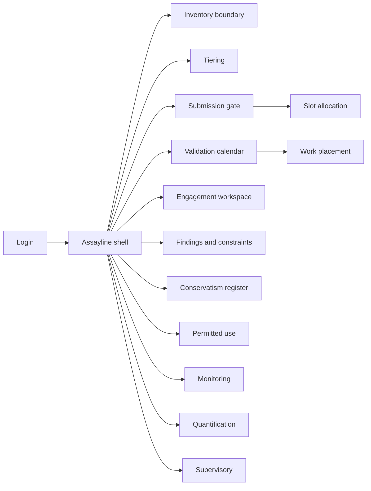
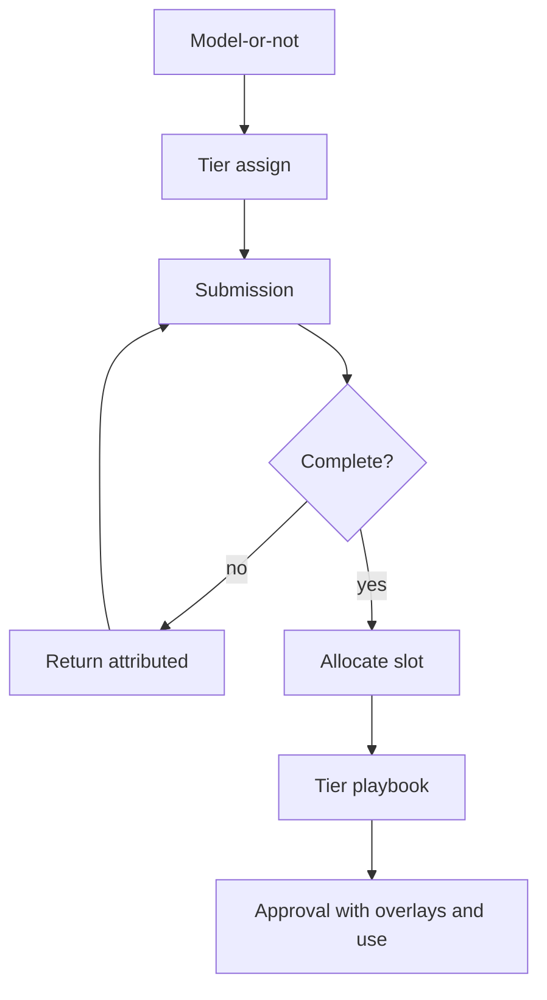

# Assayline — Web app

**Product:** [PRODUCT.md](./PRODUCT.md)
**Primary surface:** Validation factory operating system (submission gate → tiered calendar → approval with conservatism & use constraints)
**Secondary surfaces:** Conservatism overlay register (capital decision view); supervisory pack assembler
**Design thesis:** Assayline is a production line for model validation, not a GRC filing cabinet — the UI metaphor is an assay stamp: incomplete ore is refused at the gate; accepted lots get a tier stamp that selects playbook depth; approved models leave with priced conservatism overlays like assay certificates. Visual language is graphite and brass: brass for accepted slots and explicit overlays, slag-red for returns attributed upstream, cool steel for capacity forecasts. Brand wordmark marks every gate and every capital register so the CRO knows throughput and conservatism were assayed here.

## UX research synthesis

### Category peers (best-in-class)

- **SAS Model Risk Management:** End-to-end model inventory, workflow, and validation documentation for banks. Steal: structured engagement artefacts and finding workflows; reject treating incomplete submissions as “in progress validation.”
- **Moody’s Analytics / RiskAuthority-style model inventory:** Materiality-driven inventories with regulatory model focus. Steal: clear model boundary and materiality fields; reject inventory-only UIs without a capacity calendar.
- **ValidMind / modern MRM documentation platforms:** Developer-facing submission packages with completeness checks. Steal: pre-slot gap lists visible to submitters; reject consultancy day-rate opacity on unit cost.
- **ServiceNow / enterprise PMO capacity boards (adapted):** Skill-aware resource calendars and SLA commitments. Steal: slot allocation against skills/load and forward capacity vs growth; reject generic IT change tickets as the validation metaphor.

### Patterns to adopt / reject

- **Adopt:** Model-or-not determinations with appeal; completeness gate before slot; delay attribution to submitters; tier→playbook depth; capacity commitments and growth forecast; findings that constrain use; explicit conservatism register; permitted-use + exceptions; independence hard-blocks; offshore data-sensitivity basis; supervisory packs from live record.
- **Reject:** Mailbox submissions; Word-only templates as system of record; “validate everything comprehensively” default; implicit undocumented conservatism at approval; vanity inventory counts without boundary criteria; purple AI validation assistants as the gate.

### Trust, density, and workflow constraints from PRODUCT.md

Undocumented inventory boundaries fail capital and supervisors (BR-1). Incomplete submissions cannot take slots; returns are attributed (BR-2). Depth follows tier (BR-3). Capacity and unit cost are published commitments (BR-4). Conservatism must be explicit overlays (BR-5). Misuse is governed via permitted use (BR-6). Independence is enforced in-system (BR-7). Quantification and KPIs against appetite (BR-8). Findings constrain use (BR-9). Monitoring triggers revalidation (BR-10). Supervisory add-ons are managed liabilities (BR-11). Offshore/external placement is priced and sensitivity-based (BR-12).

## Information architecture

### Nav model

### Roles → default home

| Role | Default home | Why |
|------|--------------|-----|
| Head of MRM | Capacity forecast + conservatism aggregate | Throughput and capital (BR-4, BR-5) |
| Validation PMO lead | Submission gate + calendar | Slot hygiene (BR-2) |
| Onshore validator | Engagement workspace | Tier playbook (BR-3) |
| Offshore / external lead | Placement queue | Sensitivity basis (BR-12) |
| Model developer | Submission completeness | Pre-slot gaps |
| Model owner | Permitted use + monitoring | Accountability for decisions |
| Control unit | Standards and appeals | Own the gate (BR-2, BR-7) |
| Internal audit | Independence + depth-vs-tier tests | Audit process |
| Supervisory relations | Supervisory packs / add-ons | Live-record exams (BR-11) |

### Cross-links to OpenAPI resources

| Nav area | OpenAPI tags / resources |
|----------|---------------------------|
| Model-or-not / inventory | Inventory |
| Materiality / tiers | Tiering |
| Completeness / returns | Submissions |
| Calendar / engagements / placement | Validation |
| Severities / use constraints | Findings |
| Overlays | Conservatism |
| Permitted use / exceptions | Use |
| Thresholds / revalidation | Monitoring |
| Appetite / buffers / KPIs | Quantification |
| Add-ons / packs | Supervisory |

## Screen inventory

### Capacity and factory home

- **Purpose:** Cycle time and cost per validated model by tier; estate growth vs capacity for next four quarters.
- **Entry:** Head of MRM default.
- **Layout regions:** Capacity commitment strip; growth forecast chart; external effort share; open add-ons liability; conservatism aggregate teaser.
- **Primary actions:** Open calendar; escalate resourcing; open conservatism register.
- **Empty / loading / error:** No capacity model = banner to configure skills/load before promising SLAs.
- **BR / story ties:** BR-4, BR-11, BR-12; head of MRM stories.

### Inventory boundary

- **Purpose:** Written, dated model-or-not determinations with criteria, determiner, appeal.
- **Entry:** Inventory nav; artefact intake.
- **Layout regions:** Candidate list; criteria checklist; determination record; appeal status; inventory count with boundary note.
- **Primary actions:** Determine; appeal; publish criteria version.
- **Empty / loading / error:** Undetermined artefacts cannot enter tiering.
- **BR / story ties:** BR-1.

### Tiering board

- **Purpose:** Set tier from materiality, loss, uncertainty, regulatory impact, intended use; select playbook depth.
- **Entry:** After determination; tier challenge.
- **Layout regions:** Criteria scores; tier stamp; playbook preview (replication/challenger required?); history of re-tiers.
- **Primary actions:** Assign tier; challenge; lock for engagement.
- **Empty / loading / error:** Highest tier without challenger capacity = calendar warning.
- **BR / story ties:** BR-3.

### Submission gate

- **Purpose:** Refuse slots until completeness standard met; attribute returns to submitting function.
- **Entry:** PMO default; developer submit.
- **Layout regions:** Standard by tier; gap list (data, feeders, monitoring plan, docs, prior findings); return reasons; submitter league of returns.
- **Primary actions:** Submit; return with attribution; grant slot when complete.
- **Empty / loading / error:** Incomplete = no slot allocation control enabled.
- **BR / story ties:** BR-2; PMO and developer stories.

### Validation calendar

- **Purpose:** Allocate slots against validator skills and load; forecast commitments.
- **Entry:** From accepted submission; PMO nav.
- **Layout regions:** Calendar; skill tags; load bars; deferred queue; cycle-time SLA by tier.
- **Primary actions:** Assign engagement; rebalance; route placement.
- **Empty / loading / error:** Skill mismatch blocks assign for replication/challenger steps.
- **BR / story ties:** BR-3, BR-4.

### Work placement

- **Purpose:** Onshore / offshore / external routing with recorded data-sensitivity basis and unit cost.
- **Entry:** From calendar task.
- **Layout regions:** Task type; sensitivity basis; masked/synthetic flag; provider; unit cost accumulator.
- **Primary actions:** Place; refuse placement lacking basis; report share of effort.
- **Empty / loading / error:** Full-data replication cannot be placed offshore (hard rule).
- **BR / story ties:** BR-12.

### Engagement workspace

- **Purpose:** Execute tier playbook steps — conceptual, data, replication, challenger, sensitivity, implementation review.
- **Entry:** Validator home.
- **Layout regions:** Playbook checklist; evidence upload; independence banner; finding draft pane.
- **Primary actions:** Complete step; raise finding; request control review.
- **Empty / loading / error:** Developer identity match = validate action disabled (BR-7).
- **BR / story ties:** BR-3, BR-7; validator stories.

### Findings and use constraints

- **Purpose:** Severity-graded findings automatically restrict permitted use or require overlay until closed.
- **Entry:** From engagement; Findings nav.
- **Layout regions:** Finding queue; severity → constraint mapping; production registry sync status; closure evidence.
- **Primary actions:** Assign severity; close; push constraint.
- **Empty / loading / error:** Open high-severity on live model = constrained state unavoidable.
- **BR / story ties:** BR-9.

### Conservatism overlay register

- **Purpose:** Explicit overlays with location, magnitude, rationale, approver, review date; estate aggregate for capital decisions.
- **Entry:** Conservatism nav; approval gate; CFO/CRO view.
- **Layout regions:** Per-model overlays; aggregate priced conservatism; review-due list; remove/reduce with audit.
- **Primary actions:** Declare overlay; approve; schedule review; propose release.
- **Empty / loading / error:** Material undocumented conservatism blocks approval (BR-5).
- **BR / story ties:** BR-5; head of MRM capital story.

### Permitted use and exceptions

- **Purpose:** Record intended uses; committee exceptions with expiry and conditions — misuse prevention.
- **Entry:** Use nav; model owner home.
- **Layout regions:** Permitted-use list; exception requests; committee decision; expiry countdown; breach log.
- **Primary actions:** Request exception; authorise; expire; flag misuse.
- **Empty / loading / error:** Use outside record without exception = production invoke blocked where integrated.
- **BR / story ties:** BR-6; model owner stories.

### Monitoring and revalidation

- **Purpose:** Owner/developer obligations, thresholds, breach and change-of-use triggers.
- **Entry:** Monitoring nav; post-approval.
- **Layout regions:** Obligation matrix; threshold status; breach events; revalidation intake to gate.
- **Primary actions:** Acknowledge breach; trigger revalidation; update thresholds.
- **Empty / loading / error:** Missing obligations at approval = incomplete approval checklist.
- **BR / story ties:** BR-10.

### Quantification and appetite

- **Purpose:** Per-model and aggregate model risk vs appetite; lump-sum buffers where unquantifiable; KPI set.
- **Entry:** Quantification nav; board prep.
- **Layout regions:** Appetite dial; quantified risk; buffers; KPIs (performance, open findings).
- **Primary actions:** Update quantification; fix buffer; export to CRO pack.
- **Empty / loading / error:** Unquantified without buffer = standing finding.
- **BR / story ties:** BR-8.

### Supervisory liability and packs

- **Purpose:** Track add-ons/buffers with remediation; assemble exam packs from live record.
- **Entry:** Supervisory nav.
- **Layout regions:** Add-on register; remediation progress; pack builder (boundary, tiering, evidence, findings, quantification).
- **Primary actions:** Update remediation; generate pack; verify completeness.
- **Empty / loading / error:** Pack generation fails if live record gaps exist — no reconstruct theatre.
- **BR / story ties:** BR-11; supervisory relations stories.

### Independence and standards admin

- **Purpose:** Control-unit ownership of standards; independence overrides logged; depth-vs-tier audit view.
- **Entry:** Control unit / audit.
- **Layout regions:** Completeness standard versions; tier criteria; appeal log; override log; audit sample tests.
- **Primary actions:** Publish standard; decide appeal; log override with approver.
- **Empty / loading / error:** Validator attempting control review of own engagement = blocked.
- **BR / story ties:** BR-2, BR-7; control and audit stories.

## Key flows

1. **Gate then validate** — determine model → tier → submit → completeness check → slot → playbook → findings/overlays/permitted use → approve; failure: gaps return with attribution, no slot.

2. **Finding constrains use** — raise severity → auto restrict permitted use / require overlay → close to lift (BR-9).

3. **Conservatism capital path** — declare overlays at approval → aggregate register → management review → reduce explicitly (BR-5).

4. **Misuse exception** — request out-of-intent use → committee decision → expiry/conditions → breach if violated (BR-6).

5. **Supervisory pack** — select exam scope → assemble from live inventory/validation/findings/quant/add-ons → export (BR-11).

## Design system

### Tokens (CSS variables)

- `--color-ink: #E8E6E1` — primary text
- `--color-ground: #101214` — graphite ground
- `--color-panel: #1A1D21` — panels
- `--color-rule: #33383F` — dividers
- `--color-brass: #C4A35A` — accepted slot / explicit overlay
- `--color-brass-dim: #6E5A2E` — pending assay
- `--color-slag: #C45C4A` — return / incomplete / misuse
- `--color-capacity: #6A8FA8` — capacity forecast steel
- `--color-ok: #6B9B7A` — closed finding / within appetite
- `--color-steel: #9AA3AD` — secondary labels
- `--color-brand: #D2C6A8` — Assayline wordmark
- `--font-display: "IBM Plex Sans", sans-serif` — titles and unit-cost numerals
- `--font-mono: "IBM Plex Mono", monospace` — model ids, engagement ids, hashes
- `--space-1`…`--space-8`: 4px scale
- `--radius-sm: 3px`; `--radius-md: 6px` — industrial-sharp
- `--motion-stamp: 160ms ease-out` — tier/slot stamp
- `--motion-return: 220ms ease-in` — return flash to submitter
- `--motion-constrain: 280ms` — use constraint engage
- Atmosphere: subtle mill-ruled / assay-certificate texture; soft vignette; no purple AI; no consultancy-slide gradients.

### Typography & brand

- Display for cycle time, cost per model, and aggregate conservatism; mono for model ids, overlay locations, pack seals.
- Brand on gate, calendar, conservatism, and supervisory packs; never “Dashboard” as strongest mark.
- Login: brand-first; headline (“No slot for incomplete ore”); one CTA.

### Do / don’t

- **Do:** Refuse incomplete submissions; attribute delay; stamp tier→playbook; price conservatism; enforce independence; forecast capacity vs growth.
- **Don’t:** Mailbox queues; approve with hidden conservatism; inventory vanity without boundary; editable historical tiers without history; emoji status; card grids of static KPIs.

### Accessibility & domain trust cues

- AA+ on brass/slag/capacity; gate state in text (Gapped / Accepted / Returned).
- Live regions for returns, use constraints, and independence blocks.
- Focus order: determination → tier → gate → calendar → engagement → overlays → use.
- Offshore placement always shows sensitivity basis before confirm.

## Component patterns

- **ModelDeterminationRecord** — criteria, determiner, date, appeal.
- **TierStamp** — tier with playbook depth summary.
- **CompletenessGapList** — missing components before slot.
- **SubmissionReturnAttribution** — submitter + missing parts + delay clock.
- **CapacityForecastChart** — estate growth vs validator capacity.
- **PlaybookStepper** — tier-scoped validation steps.
- **IndependenceBlock** — hard deny with override log path.
- **FindingConstraintBadge** — severity → use restriction.
- **ConservatismOverlayRow** — location, magnitude, rationale, review date.
- **PermittedUseException** — committee decision with expiry.
- **SupervisoryPackBuilder** — live-record exam assembly.
- **UnitCostTicker** — cost per validated model by tier and placement.

## Out of scope for v1 web

- Hosting model training/execution; replacing the bank’s model development stack; AI ethics product for non-model AI use cases (Appetitebind); cyber SOC triage; public model marketplaces; mobile validator apps as primary workspace; generative auto-validation that bypasses conceptual soundness judgement.
